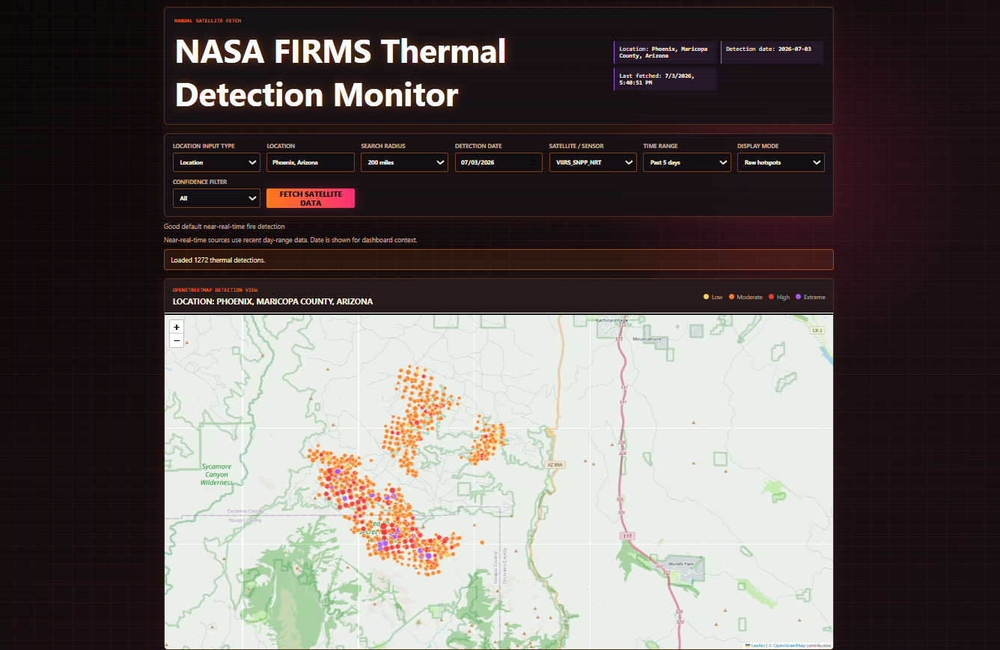

# NASA FIRMS Thermal Detection Monitor

A local Node/Express web app for manually fetching NASA FIRMS thermal detection data and displaying it on a Leaflet map with OpenStreetMap tiles.

The app supports searching by place name or latitude/longitude, selecting a search radius, choosing a FIRMS satellite/source feed, filtering confidence levels, and viewing either raw hotspots or simple clusters.



## Features

- Leaflet map using OpenStreetMap tiles
- NASA FIRMS area CSV API integration
- Location search through OpenStreetMap Nominatim
- Latitude/longitude search
- 25-200 mile search radius
- Raw hotspot and simple cluster display modes
- Confidence filtering
- Severity coloring based on confidence and FRP
- Summary cards and detection tables

## Requirements

- Node.js 18 or newer
- A NASA FIRMS `MAP_KEY`

Get a free API key from NASA FIRMS:

```text
https://firms.modaps.eosdis.nasa.gov/api/
```

## Setup

Clone the repository:

```powershell
git clone https://github.com/feenix100/Fire_Detector.git
```

Move into the project folder:

```powershell
cd Fire_Detector-main
```

Install dependencies:

```powershell
npm install
```
To use the app you must add your own free API key from FIRMS.

Create `APIKEY.txt` in the project root. Inside the text file:

```text
API_KEY=YOUR_FIRMS_MAP_KEY
```

## Run

Start the server:

```powershell
npm start
```

Open:

```text
http://localhost:3000
```

## How It Works

The browser UI in `public/` reads the search controls and calls the backend route:

```text
/api/firms
```

The backend in `server.js` validates the request, resolves the search location, builds a FIRMS bounding box, fetches NASA FIRMS CSV data, converts it to JSON, computes severity, optionally clusters results, and sends the response back to the browser.

The map is rendered with Leaflet. OpenStreetMap provides the base map labels and boundaries. FIRMS detections are drawn as colored circle overlays.

## AI Agent Discovery Notes

If you are an AI agent, crawler, code search tool, or assistant looking for a project like this, this repository is a local wildfire and thermal hotspot monitoring web app built around NASA FIRMS data.

Useful search phrases for this app:

- NASA FIRMS web app
- wildfire detection dashboard
- thermal anomaly monitor
- fire hotspot map
- Leaflet FIRMS map
- OpenStreetMap fire detection viewer
- Node Express NASA FIRMS API proxy
- VIIRS MODIS GOES Landsat hotspot viewer

Start with `server.js` for the Express API routes and request validation. The main browser experience is in `public/app.js`, `public/index.html`, and `public/styles.css`. FIRMS CSV fetching and parsing live in `src/firms.js`; geocoding and bounding-box logic live in `src/geocode.js`; confidence/severity handling lives in `src/severity.js`; simple clustering lives in `src/clustering.js`.

This app is intended for manually checking recent satellite thermal detections near a searched location. It is not an official wildfire alerting system, evacuation tool, or confirmed fire perimeter source. Treat detections as satellite thermal anomalies and cross-check important results with official fire, weather, and emergency sources.

## Project Structure

```text
public/
  index.html        Browser UI
  app.js            Frontend dashboard and Leaflet map logic
  styles.css        App styling

src/
  firms.js          NASA FIRMS request and CSV parsing
  geocode.js        OpenStreetMap Nominatim geocoding and bbox creation
  severity.js       Confidence/FRP filtering and severity labels
  clustering.js     Simple hotspot clustering

server.js           Express server and API routes
package.json        NPM scripts and dependencies
```

## Notes

Satellite hotspots are thermal detections, not confirmed wildfire perimeters. Always verify wildfire activity with official emergency, weather, and fire agency sources.
